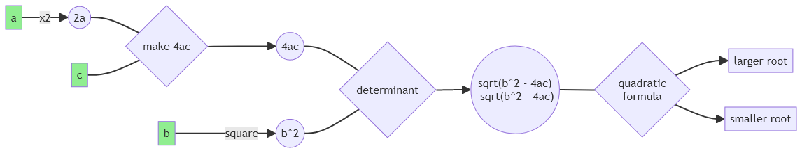

# 💧Trikkle - Dataflow Programming for Java

`Author: Steve Cao`

## Introduction

In dataflow programming, the execution of a program is modelled as a graph, where data (nodes) flows through operations
(edges/ arcs). This idea is expanded in Trikkle, where the execution graph is instead
a [directed hypergraph](https://en.wikipedia.org/wiki/Hypergraph) and each arc may have multiple input nodes and
multiple output nodes.

[Implicit parallelism](https://en.wikipedia.org/wiki/Implicit_parallelism)
is a key motivation behind the dataflow programming paradigm. In Trikkle, _anything that can be run in parallel, will be
run in parallel_.


The above animation is autogenerated.

## Key Features

- Algorithmic
  - ✅ Implicit parallelism
  - ✅ Full concurrency support
  - ✅ Efficient polling - very low overhead
- Structural
  - ✅ Implicit transitive dependencies*
  - ✅ Multiple parameters per node
  - ✅ Allows rerunning the same graph with different inputs
- ✅ Visualizations through [Mermaid.js](https://github.com/mermaid-js/mermaid)
- ✅ Java annotations support
- ✅ Unit tested
- ✅ Full JavaDoc

## Glossary

```
Datum: A piece of data of any type.

Node: A logical wrapper around 0, 1, or more datums.
Arc: A logical wrapper around a function.
Link: A connection between input nodes, an arc, and output nodes. Analogous to an entry in an adjacency list.
Graph: A collection of links with various helper indices.
Overseer: Executes a graph. Handles datum storage.

Tick: The number of times the overseer "checks" for runnable links.
Ticktock: Proper name for one such "check". E.g., the overseer ticktocks when a new node is usable.
```

## Getting Started

### 1. Creating Nodes

### 2. Creating Arcs

### 3. Creating Links

### 4. Creating Graphs

### 5. Running Graphs

## Visualization Tools

### Mermaid

### Logging

## More Features

### Nodespace

### Other Types of Nodes

#### Empty Node

#### Stream Node

### Manual Arcs and Unsafe Arcs

mention reset()

### Follow-up Overseers

### Annotations

#### Auto-generated Links

### Function Racer

### Mermaid "Animations"

## Feature Discussion

Polling, or the constant checking of execution state to discover new operations to do, is minimized. Instead of polling
on a time interval, Trikkle only searches for operations to run when new nodes have become usable. This leads to a
deterministic number of times that the program has to loop through the list of possible operations. In other words,
the _tick_ count is predictable.

## FAQ

### Why are no arcs executed in a tick occasionally?

superset theory
