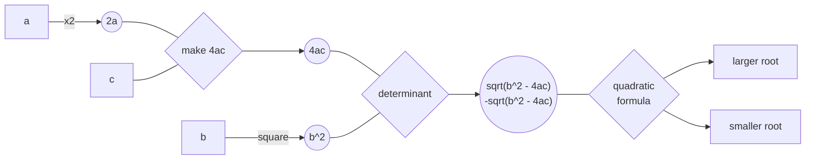

# 💧Trikkle - Dataflow Programming for Java

`Author: Steve Cao`

## Introduction

In dataflow programming, the execution of a program is modelled as a graph, where data (nodes) flows through operations
(edges/ arcs). This idea is expanded in Trikkle, where the execution graph is instead
a [directed hypergraph](https://en.wikipedia.org/wiki/Hypergraph) and each arc may have multiple input nodes and
multiple output nodes.

[Implicit parallelism](https://en.wikipedia.org/wiki/Implicit_parallelism)
is a key motivation behind the dataflow programming paradigm. In Trikkle, _anything that can be run in parallel, will be
run in parallel_.


The above animation is autogenerated.

## Key Features

- Algorithmic
    - ✅ Implicit parallelism
    - ✅ Full concurrency support
    - ✅ Efficient polling - very low overhead
- Structural
    - ✅ Implicit transitive dependencies ([learn more](#implicit-transitive-dependencies))
    - ✅ Multiple parameters per node
    - ✅ Allows rerunning the same graph with different inputs
- ✅ Visualizations through [Mermaid.js](https://github.com/mermaid-js/mermaid)
- ✅ Java annotations support
- ✅ Unit tested
- ✅ Full JavaDoc

## Glossary

```
Datum: A piece of data of any type.
Datum name: The key to one datum or a stream of alike datums. See stream node for more.

Node: A logical wrapper around 0, 1, or more datums.
Arc: A logical wrapper around a function.
Link: A connection between input nodes, an arc, and output nodes. Analogous to an entry in an adjacency list.
Graph: A collection of links with various helper indices.
Overseer: Executes a graph. Handles datum storage.

Tick: The number of times the overseer "checks" for runnable links.
Ticktock: Proper name for one such "check". E.g., the overseer ticktocks when a new node is usable.
```

## Getting Started

Let's recreate the example shown in the animation above. Code can be found
at [QuadraticExample](src/test/java/QuadraticExample.java).



### 1. Creating Nodes

```java
Node nodeA = new DiscreteNode("a");
Node nodeB = new DiscreteNode("b");
Node nodeC = new DiscreteNode("c");

Node node2A = new DiscreteNode("2a");
Node nodeBsq = new DiscreteNode("b^2");
Node node4AC = new DiscreteNode("4ac");

Node nodeDetsqrt = new DiscreteNode("sqrt(b^2 - 4ac)", "-sqrt(b^2 - 4ac)");

Node nodePosSoln = new DiscreteNode("larger root");
Node nodeNegSoln = new DiscreteNode("smaller root");
```

### 2. Creating Arcs

```java
Arc arc1 = new AutoArc("x2") {
  @Override
  protected void run() {
    double a = (double) getDatum("a");

    returnDatum("2a", 2 * a);
  }
};
Arc arc2 = new AutoArc("square") {
  @Override
  protected void run() {
    double b = (double) getDatum("b");

    returnDatum("b^2", b * b);
  }
};
Arc arc3 = new AutoArc("make 4ac") {
  @Override
  protected void run() {
    double twiceA = (double) getDatum("2a");
    double c = (double) getDatum("c");

    returnDatum("4ac", 2 * twiceA * c);
  }
};
Arc arc4 = new AutoArc("determinant") {
  @Override
  protected void run() {
    double bsq = (double) getDatum("b^2");
    double fourAC = (double) getDatum("4ac");

    returnDatum("sqrt(b^2 - 4ac)", Math.sqrt(bsq - fourAC));
    returnDatum("-sqrt(b^2 - 4ac)", -Math.sqrt(bsq - fourAC));
  }
};
Arc arc5 = new AutoArc("quadratic<br>formula") {
  @Override
  protected void run() {
    double b = (double) getDatum("b");
    double twiceA = (double) getDatum("2a");
    double detsqrtpos = (double) getDatum("sqrt(b^2 - 4ac)");
    double detsqrtneg = (double) getDatum("-sqrt(b^2 - 4ac)");

    returnDatum("larger root", (-b + detsqrtpos) / twiceA);
    returnDatum("smaller root", (-b + detsqrtneg) / twiceA);
  }
};
```

### 3. Creating Links

```java
List<Link> links = new ArrayList<>();
links.add(new Link(Set.of(nodeA), arc1, node2A));
links.add(new Link(Set.of(nodeB), arc2, nodeBsq));
links.add(new Link(Set.of(node2A, nodeC), arc3, node4AC));
links.add(new Link(Set.of(nodeBsq, node4AC), arc4, nodeDetsqrt));
links.add(new Link(Set.of(nodeDetsqrt), arc5, Set.of(nodePosSoln, nodeNegSoln)));
```

#### Implicit transitive dependencies

Note that in the last link, although `arc5` uses the datums `b` and `2a`, the link does not need to include `nodeB`
and `node2A` as dependencies, because the usability of `nodeDetsqrt` implies the usability of `nodeB` and `node2A`.
This works because datums are just stored in a hash map and there are no access restrictions.

### 4. Creating Graphs

```java
Graph graph = new Graph(links);
System.out.println(graph);
```

#### Output:

```
flowchart LR
classDef hidden display:none;
node1["smaller root"]
node2["larger root"]
node3(("2a"))
node4["a"]
node5["b"]
node6(("sqrt(b^2 - 4ac)<br>-sqrt(b^2 - 4ac)"))
node7(("b^2"))
node8["c"]
node9(("4ac"))
arc1{"make 4ac"}
arc3{"quadratic<br>formula"}
arc5{"determinant"}
node3 & node8 --- arc1 --> node9
node5 -- "square" --> node7
node6 --- arc3 --> node2 & node1
node4 -- "x2" --> node3
node9 & node7 --- arc5 --> node6
```

#### Rendered:


### 5. Running Graphs

```java
Overseer overseer = new Overseer(graph);
overseer.setLogging(true);
overseer.addStartingDatum("a", 1.0);
overseer.addStartingDatum("b", 5.0);
overseer.addStartingDatum("c", 6.0);
overseer.start();

System.out.println("Final tick: " + overseer.getTick());

System.out.println("\nLink trace:");
System.out.print(LogUtils.linkTraceToString(overseer.getLinkTrace()));

System.out.println("\nFinal cache:");
for (Map.Entry<String, Object> stringObjectEntry : overseer.getCacheCopy().entrySet()) {
  System.out.println(stringObjectEntry);
}
```

#### Output:

```
Final tick: 5

Link trace:
Tick 1:
[Node[b]] -> square -> [Node[b^2]]
[Node[a]] -> x2 -> [Node[2a]]

Tick 2:

Tick 3:
[Node[c], Node[2a]] -> make 4ac -> [Node[4ac]]

Tick 4:
[Node[4ac], Node[b^2]] -> determinant -> [Node[sqrt(b^2 - 4ac), -sqrt(b^2 - 4ac)]]

Tick 5:
[Node[sqrt(b^2 - 4ac), -sqrt(b^2 - 4ac)]] -> quadratic<br>formula -> [Node[smaller root], Node[larger root]]


Final cache:
a=1.0
b=5.0
c=6.0
larger root=-2.0
4ac=24.0
b^2=25.0
sqrt(b^2 - 4ac)=1.0
smaller root=-3.0
2a=2.0
-sqrt(b^2 - 4ac)=-1.0
```

## Visualization Tools

### Mermaid

A graph's `toString()` method returns a Mermaid flowchart string. For more advanced settings such as prefixing nodes and
arcs with a namespace and visualizing multiple graphs with Mermaid subgraphs, check
out [MermaidGraphViz](src/main/java/org/trikkle/viz/MermaidGraphViz.java).

### Logging

Check out [LogUtils](src/main/java/org/trikkle/viz/LogUtils.java) for some packaged logging visualization methods.
You may also set a listener that's run on every ticktock by using `overseer.setObserver(Overseer.Observer)`.

## More Features

### Nodespace

In Trikkle, two nodes with the same datum names but which are not the same object will **not** be seen as identical
nodes. If they have the same datum names, they are merely _congruent_.
(see [Congruent](src/main/java/org/trikkle/Congruent.java) for more details)

A nodespace lets you reuse the same node object without passing the object around. You can also use the default global 
nodespace through `Nodespace.DEFAULT`. The backing map is accessible at `nodespace.nodeStore`.

```java
Nodespace ns = new Nodespace();
Node node1 = ns.discreteOf("datum1"); // creates a new discrete node
Node node2 = ns.discreteOf("datum1"); // returns the same object as node1. node1 == node2.
```

### Other Types of Nodes

#### [EmptyNode](src/main/java/org/trikkle/EmptyNode.java)

A placeholder node with no datums used to signify the completion of an arc. Discrete nodes must have at least one datum.

#### [StreamNode](src/main/java/org/trikkle/StreamNode.java)

A node that can store multiple datums of one name in a queue. Useful for parallelism between different "layers" of the 
graph.

### Manual Arcs and Unsafe Arcs

The `AutoArc` class is a subclass of `Arc` that automatically handles arc progression. See [ArcStatus](src/main/java/org/trikkle/ArcStatus.java) for more details. An `AutoArc` is simple because it can only be run once. If you want to manage arc status 
yourself or run one arc many times, you need to use the `Arc` class directly. This is particularly handy as the output
arc of a `StreamNode`.

An unsafe arc can lower its status, allowing it to be run again. This may lead to deadlocks and live locks so 
unsafe arcs cannot be run through a recursive ticktock by default. See 
[Overseer](src/main/java/org/trikkle/Overseer.java) for more details.

### Follow-up Overseers

An overseer can carry on where a previous one left off, perhaps with an extended graph. See the constructor
`Overseer(graph, initialCache)` in [Overseer](src/main/java/org/trikkle/Overseer.java) for more details.

You can also easily fill the starting datums of an overseer with the ending datums of a previously run one.

E.g., `overseer2.fillStartingDatums(overseer1.getResultCache())`

### Function Racer

A helper class [FunctionRacer](src/main/java/org/trikkle/FunctionRacer.java) is provided to help you race two functions
and take the result of the first one that finishes, interrupting the rest. Useful if you have multiple ways to get to
a result and you don't know ahead of time which would be faster.

### Annotations

TODO

#### Auto-generated Links

TODO

### Mermaid "Animations"

This is very hacky but looks pretty good.

Use `LogUtils.toMarkdown(LogUtils.animate(graph, linkTrace))` and 
[Animating Mermaid diagrams with terrible hacks](https://blog.lmorchard.com/2023/01/03/mermaid-animations/).

Follow it up with [svgexport](https://github.com/piqnt/svgexport) to convert everything to png and
[gifski](https://github.com/sindresorhus/Gifski) to finally turn it into a gif.

## Feature Discussion

A "tick" passes every time the overseer checks for runnable links and runs them. The frequency and timing of going to
the next tick, or "ticktocking" was a subject of much deliberation. The current implementation is to ticktock sparsely
and economically, only when
<ol>
<li>the state of the <b>nodes</b> change (not the arcs) - aka <b>recursive ticktock</b></li>
<li>no change was detected but the overseer has not finished - aka <b>iterative ticktock.</b></li>
</ol>
<p>
This allows the overseer to tick only when needed and avoids the overhead of polling.
All this leads to a deterministic number of times that the program has to loop through the list of possible operations.
In other words, the tick count is predictable.

## FAQ

### Why are no arcs executed in a tick occasionally?

The overseer's actual ticktocks are a superset of its necessary ticktocks. 

It could be the case that only one out of n dependencies were filled and a ticktock occurred only to find no links
runnable.

Moreover, since the list of links is not synchronized,
it could be that the state of the program updated during the iteration through links of a previous ticktock.
Essentially, the link was _stolen_ by a ticktock that occurred earlier, leaving this ticktock with nothing to run.
