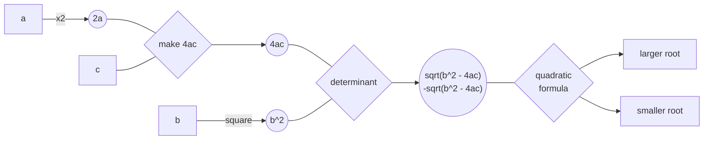

# 💧Trikkle - Dataflow Programming for Java

`Author: Steve Cao`

## Introduction

In dataflow programming, the execution of a program is modelled as a graph, where data (nodes) flows through operations
(edges/ arcs). This idea is expanded in Trikkle, where the execution graph is instead
a [directed hypergraph](https://en.wikipedia.org/wiki/Hypergraph) and each arc may have multiple input nodes and
multiple output nodes.

[Implicit parallelism](https://en.wikipedia.org/wiki/Implicit_parallelism)
is a key motivation behind the dataflow programming paradigm. In Trikkle, _anything that can be run in parallel, will be
run in parallel_.


The above animation is autogenerated.

## Key Features

- Algorithmic
  - ✅ Implicit parallelism
  - ✅ Full concurrency support
  - ✅ Efficient polling - very low overhead
- Structural
  - ✅ Implicit transitive dependencies ([learn more](#implicit-transitive-dependencies))
  - ✅ Multiple parameters per node
  - ✅ Allows rerunning the same graph with different inputs
- ✅ Visualizations through [Mermaid.js](https://github.com/mermaid-js/mermaid)
- ✅ Java annotations support
- ✅ Unit tested
- ✅ Full JavaDoc

## Glossary

```
Datum: A piece of data of any type.

Node: A logical wrapper around 0, 1, or more datums.
Arc: A logical wrapper around a function.
Link: A connection between input nodes, an arc, and output nodes. Analogous to an entry in an adjacency list.
Graph: A collection of links with various helper indices.
Overseer: Executes a graph. Handles datum storage.

Tick: The number of times the overseer "checks" for runnable links.
Ticktock: Proper name for one such "check". E.g., the overseer ticktocks when a new node is usable.
```

## Getting Started

Let us recreate the example shown in the animation above.



### 1. Creating Nodes

```java
Node nodeA = new DiscreteNode("a");
Node nodeB = new DiscreteNode("b");
Node nodeC = new DiscreteNode("c");

Node node2A = new DiscreteNode("2a");
Node nodeBsq = new DiscreteNode("b^2");
Node node4AC = new DiscreteNode("4ac");

Node nodeDetsqrt = new DiscreteNode("sqrt(b^2 - 4ac)", "-sqrt(b^2 - 4ac)");

Node nodePosSoln = new DiscreteNode("larger root");
Node nodeNegSoln = new DiscreteNode("smaller root");
```
### 2. Creating Arcs

```java
Arc arc1 = new AutoArc("x2") {
  @Override
  protected void run() {
    double a = (double) getDatum("a");
    
    returnDatum("2a", 2 * a);
  }
};
Arc arc2 = new AutoArc("square") {
  @Override
  protected void run() {
    double b = (double) getDatum("b");

    returnDatum("b^2", b * b);
  }
};
Arc arc3 = new AutoArc("make 4ac") {
  @Override
  protected void run() {
    double twiceA = (double) getDatum("2a");
    double c = (double) getDatum("c");

    returnDatum("4ac", 2 * twiceA * c);
  }
};
Arc arc4 = new AutoArc("determinant") {
  @Override
  protected void run() {
    double bsq = (double) getDatum("b^2");
    double fourAC = (double) getDatum("4ac");

    returnDatum("sqrt(b^2 - 4ac)", Math.sqrt(bsq - fourAC));
    returnDatum("-sqrt(b^2 - 4ac)", -Math.sqrt(bsq - fourAC));
  }
};
Arc arc5 = new AutoArc("quadratic<br>formula") {
  @Override
  protected void run() {
    double b = (double) getDatum("b");
    double twiceA = (double) getDatum("2a");
    double detsqrtpos = (double) getDatum("sqrt(b^2 - 4ac)");
    double detsqrtneg = (double) getDatum("-sqrt(b^2 - 4ac)");

    returnDatum("larger root", (-b + detsqrtpos) / twiceA);
    returnDatum("smaller root", (-b + detsqrtneg) / twiceA);
  }
};
```
### 3. Creating Links

```java
List<Link> links = new ArrayList<>();
links.

add(new Link(Set.of(nodeA),arc1,node2A));
        links.

add(new Link(Set.of(nodeB),arc2,nodeBsq));
        links.

add(new Link(Set.of(node2A, nodeC),arc3,node4AC));
        links.

add(new Link(Set.of(nodeBsq, node4AC),arc4,nodeDetsqrt));
        links.

add(new Link(Set.of(nodeDetsqrt),arc5,Set.

of(nodePosSoln, nodeNegSoln)));
```

#### Implicit transitive dependencies

Note that in the last link, although `arc5` uses the datums `b` and `2a`, the link does not need to include `nodeB`
and `node2A` as dependencies, because the usability of `nodeDetsqrt` implies the usability of `nodeB` and `node2A`.
### 4. Creating Graphs

```java
Graph graph = new Graph(links);
```
### 5. Running Graphs

```java
Overseer overseer = new Overseer(graph);
overseer.

setLogging(true);
overseer.

addStartingDatum("a",1.0);
overseer.

addStartingDatum("b",5.0);
overseer.

addStartingDatum("c",6.0);
overseer.

start();

System.out.

println("Final tick: "+overseer.getTick());
        System.out.

println("\nLink trace:");
for(
Collection<Link> linkCollection :overseer.

getLinkTrace()){
        System.out.

println(linkCollection);
}
        System.out.

println("\nFinal cache:");
for(
Map.Entry<String, Object> stringObjectEntry :overseer.

getCacheCopy().

entrySet()){
        System.out.

println(stringObjectEntry);
}
```

### 6. Output

```
Final tick: 5

Link trace:
[[Node[b]] -> square -> [Node[b^2]], [Node[a]] -> x2 -> [Node[2a]]]
[]
[[Node[c], Node[2a]] -> make 4ac -> [Node[4ac]]]
[[Node[4ac], Node[b^2]] -> determinant -> [Node[sqrt(b^2 - 4ac), -sqrt(b^2 - 4ac)]]]
[[Node[sqrt(b^2 - 4ac), -sqrt(b^2 - 4ac)]] -> quadratic<br>formula -> [Node[smaller root], Node[larger root]]]

Final cache:
a=1.0
b=5.0
c=6.0
larger root=-2.0
4ac=24.0
b^2=25.0
sqrt(b^2 - 4ac)=1.0
smaller root=-3.0
2a=2.0
-sqrt(b^2 - 4ac)=-1.0
```

## Visualization Tools

### Mermaid

### Logging

## More Features

### Nodespace

### Other Types of Nodes

#### Empty Node

#### Stream Node

### Manual Arcs and Unsafe Arcs

mention reset()

### Follow-up Overseers

### Annotations

#### Auto-generated Links

### Function Racer

### Mermaid "Animations"

## Feature Discussion

Polling, or the constant checking of execution state to discover new operations to do, is minimized. Instead of polling
on a time interval, Trikkle only searches for operations to run when new nodes have become usable. This leads to a
deterministic number of times that the program has to loop through the list of possible operations. In other words,
the _tick_ count is predictable.

## FAQ

### Why are no arcs executed in a tick occasionally?

superset theory
